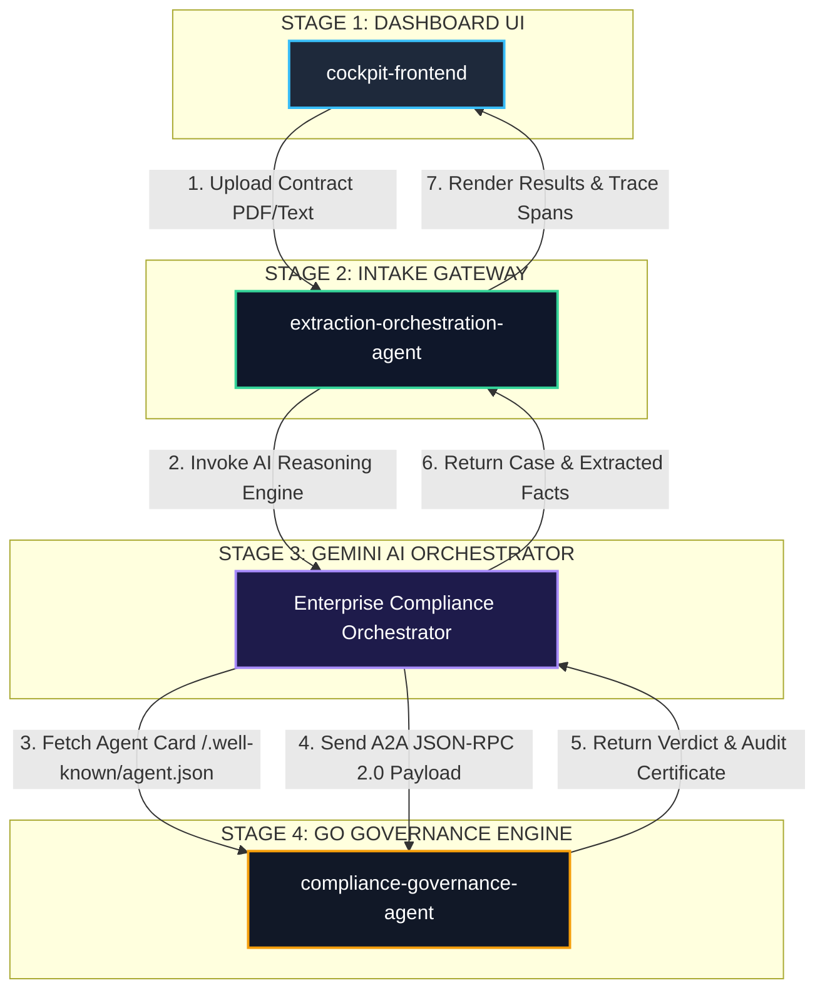

# 🏛️ Multi-Agent Architecture & Execution Flow

This document details the system architecture, component responsibilities, and execution sequence for the **Enterprise Multi-Agent Compliance Pipeline**.

---

## 🗺️ System Component Diagram

---

## 📋 Service Mapping Reference

| Diagram Node | Exact GCP Service Name | Hosting Platform & Region | Technology Stack | Role & Responsibilities |
|---|---|---|---|---|
| **`cockpit-frontend`** | `cockpit-frontend` | **Cloud Run** (`europe-west3`) | HTML5 / CSS3 / Nginx | Dark-mode operational dashboard displaying live audits, OpenTelemetry trace timelines, and audit badges. |
| **`extraction-orchestration-agent`** | `extraction-orchestration-agent` | **Cloud Run** (`europe-west3`) | Python 3.11 / FastAPI | Web intake API gateway bridging browser UI requests to GCP AI services and managing SQLite baseline reads/writes. |
| **`Enterprise Compliance Orchestrator`** | `Enterprise Compliance Orchestrator Agent` | **Gemini Enterprise Agent Platform** (`europe-west3`) | Python ADK / Gemini 2.5 | Managed AI Reasoning Engine running Gemini 2.5 to extract contract parameters and drive A2A orchestration. |
| **`compliance-governance-agent`** | `compliance-governance-agent` | **Cloud Run** (`europe-west3`) | Compiled Go 1.22 | Deterministic policy engine exposing `GET /.well-known/agent.json` (Agent Card) and `POST /` (JSON-RPC 2.0). Enforces hard $500k policy caps. |

---

## ⏱️ Step-by-Step Execution Sequence

1. **User Contract Intake**: The operator uploads a contract PDF/text or selects a sample agreement in `cockpit-frontend`.
2. **Gateway Dispatch**: The browser sends `POST /api/compliance/upload` to `extraction-orchestration-agent`.
3. **AI Fact Extraction**: The Gateway invokes `ReasoningEngine.query()` on the `Enterprise Compliance Orchestrator Agent` (Gemini Enterprise Agent Platform). Gemini 2.5 parses the text and returns structured contract parameters.
4. **Historical Benchmark Lookup**: The Gateway compares the contract value against historical vendor baselines in SQLite to compute `value_variance_pct` (>20% escalation flag).
5. **A2A Agent Card Discovery**: The AI Orchestrator fetches `compliance-governance-agent`'s Agent Card (`GET /.well-known/agent.json`) to resolve its capabilities and protocols.
6. **A2A Audit Handoff**: The Orchestrator constructs an A2A JSON-RPC 2.0 `message/send` payload with GCP OIDC Identity Tokens and sends it to `compliance-governance-agent`.
7. **Deterministic Policy Check**: The Go agent evaluates compiled policy rules ($500k value cap, 5-year max term, insurance floors, unlimited liability bans) and generates an inline HTML Governance Audit Certificate badge.
8. **UI Timeline Rendering**: Results flow back to `cockpit-frontend`, rendering OpenTelemetry trace spans, A2A payload inspector JSON, and the audit badge.
