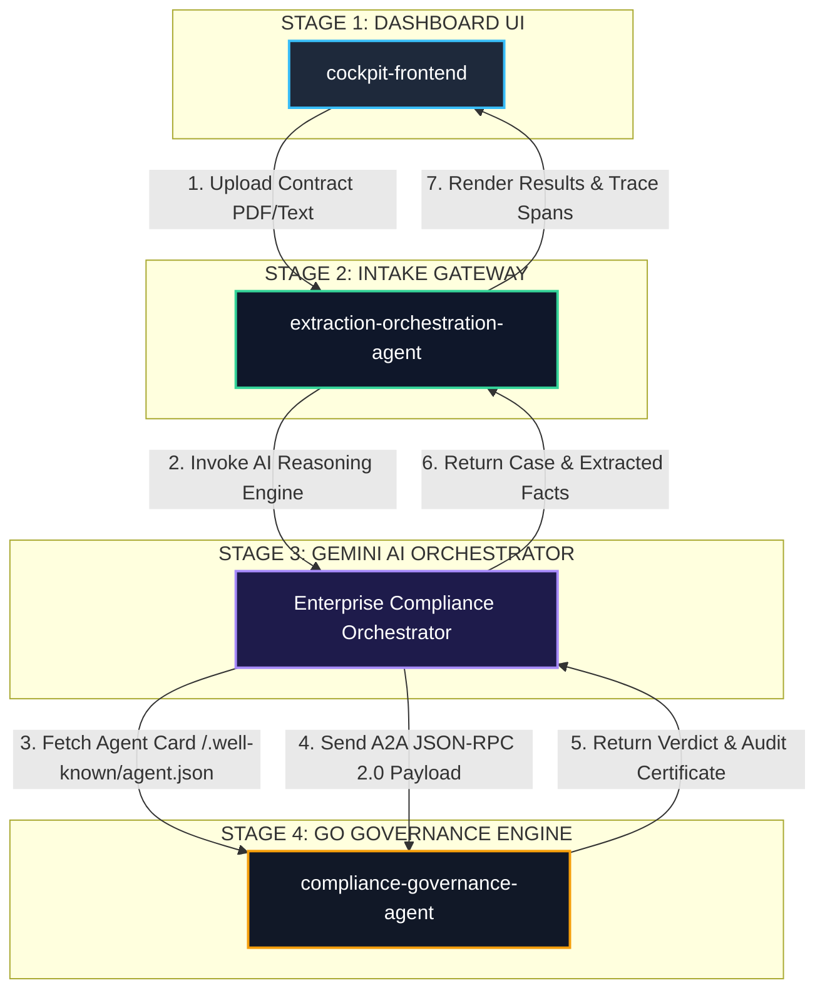

# 🏛️ Enterprise Multi-Agent A2A Compliance Workshop

Welcome to the hands-on repository for the **Enterprise Multi-Agent Compliance Workshop**.

This repository demonstrates how to build, test, and deploy a production-grade **Contract Compliance Application** on Google Cloud and **Gemini Enterprise Agent Platform** using two autonomous engineering teams.

---

## 📁 Monorepo Structure

```text
a2a-compliance-workshop/
├── extraction-orchestration-agent/   <── GROUP A / STAGE 1 (Python ADK + Gemini 2.5 + Gateway)
├── compliance-governance-agent/      <── GROUP B / STAGE 2 (Go A2A Agent Card + Policy Engine)
├── cockpit-frontend/                 <── STAGE 3 (Interactive User Review Cockpit UI)
├── EXERCISES.md                      <── Hands-on exercise guide & TODOs for Teams A & B
├── ARCHITECTURE.md                   <── Full system architecture & sequence flow
└── README.md                         <── Master Workshop Guide
```

---

## 🎯 System Architecture & Component Diagram



> 📄 For complete service mappings, sequence diagrams, and protocol specifications, see [**`ARCHITECTURE.md`**](ARCHITECTURE.md).

---

## 🛠️ Workshop Hands-On Exercises

See [**`EXERCISES.md`**](EXERCISES.md) for detailed exercise breakdowns and tasks:

* **Team A (Python ADK & Agent Platform)**:
  Work inside `extraction-orchestration-agent/`. Implement Gemini 2.5 fact extraction (`tools.py`), historical variance calculation, A2A JSON-RPC dispatch (`agent.py`), and deploy as a Vertex AI Reasoning Engine on Gemini Enterprise Agent Platform (`deploy_to_agent_platform.py`).

* **Team B (Go Governance & Policy Engine)**:
  Work inside `compliance-governance-agent/`. Implement the A2A Agent Card endpoint (`card.go`), JSON-RPC 2.0 router (`jsonrpc.go`), 100% deterministic policy engine ($500k value cap, 5-year max term in `engine.go`), and containerize via Dockerfile.

* **Joint Integration (User Cockpit Dashboard)**:
  Work inside `cockpit-frontend/`. Connect the UI to Team A's live Cloud Run gateway URL and run end-to-end contract compliance audits!

---

## 🚀 Cloud Deployment Sequence

1. **Stage 1 (Team A Deployment)**:
   Deploy `extraction-orchestration-agent` to Gemini Enterprise Agent Platform / Cloud Run in `europe-west3`.
2. **Stage 2 (Team B Deployment)**:
   Deploy `compliance-governance-agent` to Cloud Run in `europe-west3`. Set Team A's `REMOTE_A2A_AGENT_CARD_URL` to Team B's live URL (`/.well-known/agent.json`).
3. **Stage 3 (Frontend Deployment)**:
   Deploy `cockpit-frontend` to Cloud Run, pointing `API_ORIGIN` to Team A's live Orchestration Gateway.
